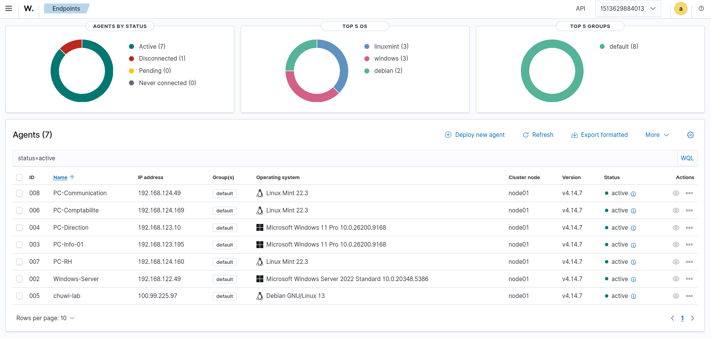

# Portfolio — Florent Vazeux

# Administrateur d'infrastructures sécurisées (AIS) — En formation · Titre professionnel en cours.  
**Bienvenue sur mon portfolio** Vous y trouverez mes projets d'infrastructure, de supervision et d'automatisation, construits sur un homelab personnel.

---

## 📬 Contact

- **LinkedIn :** [florent-vazeux](https://www.linkedin.com/in/flo-vz04/)
- **Email :** [florentbv@outlook.fr](mailto:florentbv@outlook.fr)

---

## ⭐ Projets

### 🖧 Homelab Axone — Infrastructure d'entreprise

**Contexte :** PME fictive "Axone" — infogérance pour collectivités. Besoin d'une infrastructure centralisée avec parc hétérogène.

**Ce qui a été réalisé :**
- Domaine **Active Directory** `serv-net.lan` (Windows Server 2022) — AD, DNS, DHCP
- **5 postes** joints au domaine : 3 Linux Mint 22 + 2 Windows 11
- **GPO** : politique de mot de passe, verrouillage, désactivation SMBv1, fond d'écran, mappage lecteurs
- **Partages cloisonnés** par groupes AD (Finance, RH, Communication, Direction, Commun)
- **Supervision** : Wazuh (SIEM, 7 agents) + GLPI (inventaire multi-entités)
- **Automatisation** : Ansible (déploiement de configuration Linux)
- **Réseau** : 3 sous-réseaux libvirt, VPN Tailscale, NAT

**Matériel :** Dell OptiPlex (serveur, 24 Go) · Chuwi N100 (hôte Linux, 8 Go) · Fedora Laptop (hôte Windows, 32 Go)

---

### 🛡 Supervision SIEM — Wazuh

- SIEM déployé en Docker sur le serveur
- **7 agents** déployés sur l'ensemble du parc
- Étude de cas : **25 vulnérabilités Critical** détectées, analysées et priorisées
- Cycle documenté : Détection → Analyse → Traitement → Vérification

---

### 📋 Gestion de parc — GLPI

- Inventaire automatisé des postes (glpi-agent déployé via Ansible)
- Entité dédiée "Axone" pour cloisonner le parc
- Administrateur délégué (droits limités à l'entité)

---

## 🚀 Compétences

| Domaine | Technologies |
|---|---|
| **Systèmes** | Windows Server 2022, Windows 11, Linux (Debian, Mint), Active Directory |
| **Réseau** | VLAN, DHCP, DNS, VPN (Tailscale), NAT, routage |
| **Supervision** | Wazuh (SIEM), GLPI |
| **Automatisation** | Ansible, scripts |
| **Virtualisation** | KVM (libvirt), Docker |
| **Sécurité** | GPO, moindre privilège, cloisonnement, durcissement |

---

## 📄 À propos

En formation **Administrateur d'infrastructures sécurisées (AIS)** au GRETA 91. Projets en cours d'enrichissement.