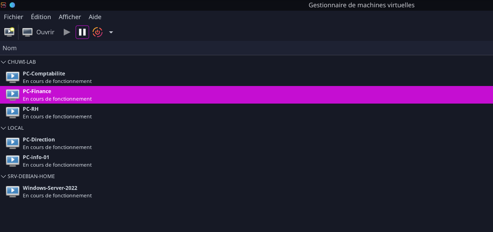
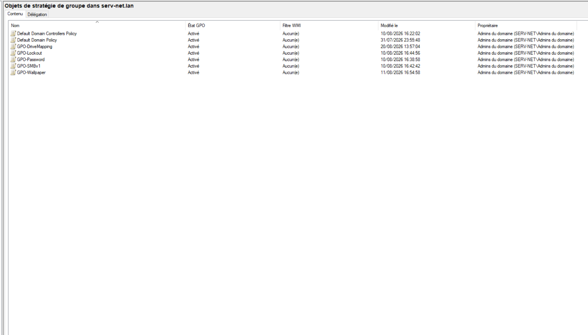
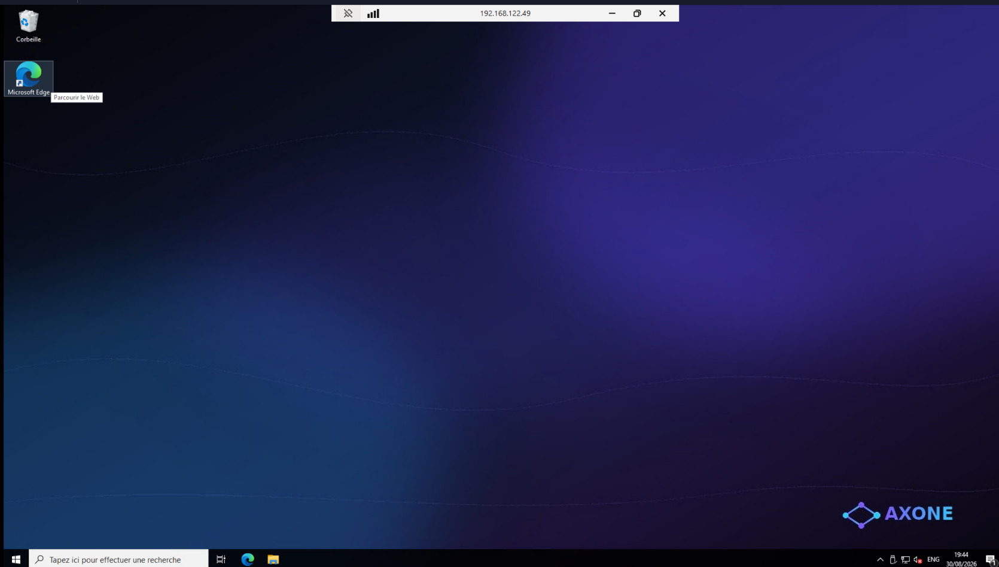
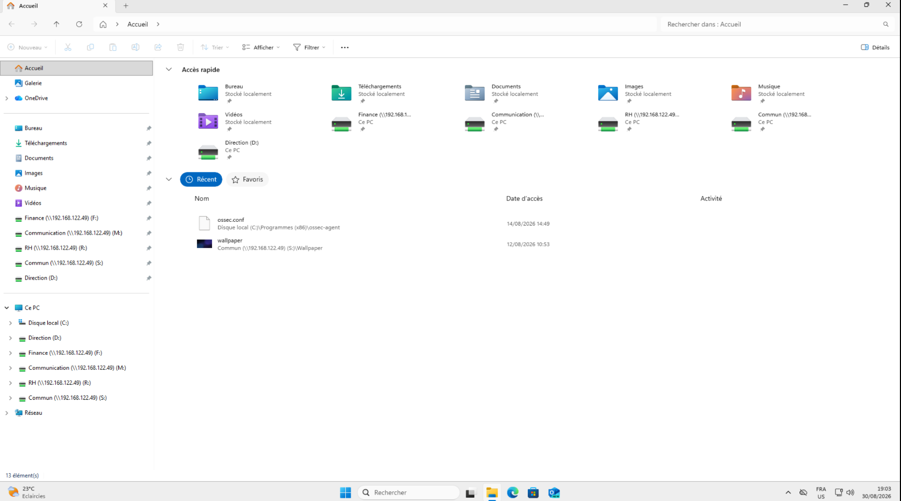
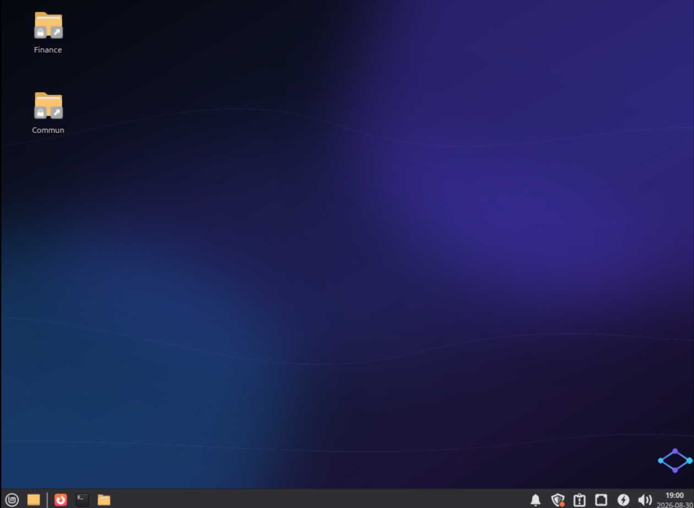

# 🖧 Homelab Axone — Infrastructure d'entreprise

**Contexte :** PME fictive "Axone" — infogérance pour collectivités. Besoin d'une infrastructure centralisée avec parc hétérogène.

**Ce qui a été réalisé :**
- Domaine **Active Directory** `serv-net.lan` (Windows Server 2022) — AD, DNS, DHCP
- **5 postes** joints au domaine : 3 Linux Mint 22 + 2 Windows 11
- **GPO** : politique de mot de passe, verrouillage, désactivation SMBv1, fond d'écran, mappage lecteurs
- **Partages cloisonnés** par groupes AD (Finance, RH, Communication, Direction, Commun)
- **Supervision** : Wazuh (SIEM, 7 agents) + GLPI (inventaire multi-entités)
- **Automatisation** : Ansible (déploiement de configuration Linux)
- **Réseau** : 3 sous-réseaux libvirt, VPN Tailscale, NAT

**Matériel :** Dell OptiPlex (serveur, 24 Go) · Chuwi N100 (hôte Linux, 8 Go) · Fedora Laptop (hôte Windows, 32 Go)

*Vue des VM's depuis le Gestionnaire Linux*

---

## 🌐 Réseau et accès distant multi-sites

L'infrastructure est répartie sur 3 sites (domicile dirigeant, open space, télétravail), interconnectés via un VPN mesh **Tailscale**.

**Architecture réseau :**

- **Réseau LAN** : `192.168.1.0/24` — Dell et Chuwi (réseau domestique)
- **Sous-réseaux libvirt isolés** :
  - Dell : `192.168.122.0/24` (contient SRV-AD, le contrôleur de domaine)
  - Chuwi : `192.168.124.0/24` (contient les 3 postes Linux Mint)
  - Fedora : `192.168.123.0/24` (contient les 2 postes Windows 11)
- **VPN mesh Tailscale** : accès distant chiffré entre les sites, sans exposer de ports sur Internet
- **Subnet routing** : le serveur Dell expose son réseau libvirt (192.168.122.0/24) via Tailscale pour que les postes distants joignent le contrôleur de domaine

**Pourquoi cette architecture ?**

Le serveur étant hébergé au domicile du dirigeant (pas de local technique), les postes de l'open space et du télétravail doivent accéder au contrôleur de domaine à distance. Tailscale permet un VPN sécurisé sans configuration de la box (pas d'IP fixe, pas d'ouverture de ports).

---

## 📊 Vue d'ensemble du parc

| Machine | OS | Rôle | Supervision |
|---|---|---|---|
| SRV-AD | Windows Server 2022 | AD, DNS, DHCP | Wazuh + GLPI |
| PC-Comptabilite | Linux Mint 22 | Comptabilité | Wazuh + GLPI |
| PC-RH | Linux Mint 22 | RH | Wazuh + GLPI |
| PC-Communication | Linux Mint 22 | Communication | Wazuh + GLPI |
| PC-Info-01 | Windows 11 | Informatique | Wazuh + GLPI |
| PC-Direction | Windows 11 | Direction | Wazuh + GLPI |

---

## 🗂 Active Directory — structure et stratégies

**Unités d'organisation :** chaque service a son OU dédiée (Comptabilité, RH, Direction, Communication, Informatique, Serveurs) pour appliquer des stratégies différenciées.

**Stratégies de groupe (GPO) :**

| GPO | Effet |
|---|---|
| GPO-Password | Mot de passe 12 car., complexité, expiration 90j |
| GPO-Lockout | Verrouillage après 5 tentatives |
| GPO-SMBv1 | Désactivation SMBv1 |
| GPO-Wallpaper | Fond d'écran Axone |
| GPO-DriveMapping | Mappage lecteurs réseau |

**Accès distant admin (RDP) :**

---

## 📁 Partages de fichiers et cloisonnement

Les données sont cloisonnées par service via des partages SMB sur le serveur, accessibles selon les groupes AD.

| Partage | Accès (groupes AD) | Contenu |
|---|---|---|
| `Finance` | grp_compta, grp_direction | Données comptables |
| `RH` | grp_rh, grp_direction | Données RH (paie, contrats) |
| `Communication` | grp_communication, grp_direction | Communication interne |
| `Commun` | Utilisateurs du domaine | Documents partagés |
| `Direction` | grp_direction | Direction |

*Vue des lecteurs réseau mappés sur le poste Direction Windows 11 avec accès total*

*Vue des partages montés sur un poste Linux Mint (dossiers dans le réseau)*

---

## 🛡 Supervision SIEM — Wazuh

- SIEM déployé en Docker sur le serveur
- **7 agents** déployés sur l'ensemble du parc
- Étude de cas : **25 vulnérabilités Critical** détectées, analysées et priorisées
- Cycle documenté : Détection → Analyse → Traitement → Vérification

---

## 📋 Gestion de parc — GLPI

- Inventaire automatisé des postes (glpi-agent déployé via Ansible)
- Entité dédiée "Axone" pour cloisonner le parc
- Administrateur délégué (droits limités à l'entité)

---

## ⚙️ Automatisation — Ansible

Gestion centralisée de la configuration des postes Linux Mint via Ansible (depuis le Chuwi, controller).

| Playbook | Rôle |
|---|---|
| `wallpaper.yml` | Déploiement du fond d'écran Axone |
| `wazuh-agent.yml` | Déploiement des agents SIEM |
| `maj-auto.yml` | MAJ de sécurité automatiques au boot |
| `glpi-agent.yml` | Déploiement des agents d'inventaire GLPI |
| `dns-fix.yml` | Correctif de résolution DNS |

*Ansible est l'équivalent des GPO pour le parc Linux : déploiement centralisé, reproductible, versionné.*

---

## 🔄 Mises à jour automatiques

Chaque machine applique les mises à jour de sécurité automatiquement, avec traçabilité :

| Machine | Méthode |
|---|---|
| Dell | `unattended-upgrades` (sécurité), timer 01:00 |
| Chuwi | Service systemd au boot |
| 3 Mint | Service systemd au boot (déployé via Ansible) |

*Les logs de MAJ sont tracés dans `/var/log/maj-auto.log`.*

---