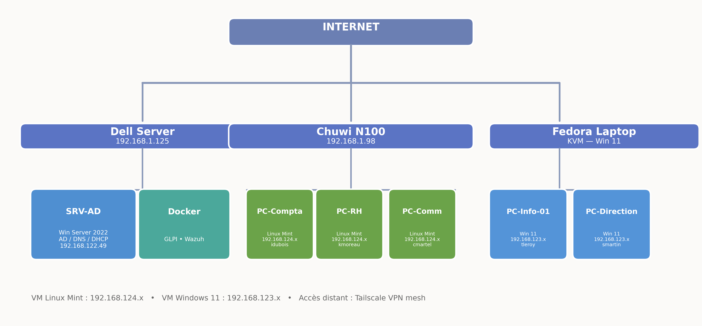
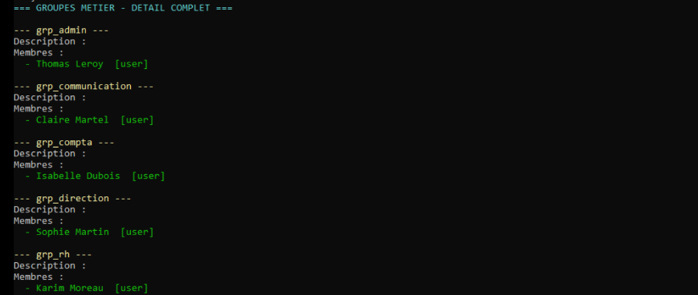

# 🖧 Homelab Axone — Infrastructure d'entreprise

**Contexte :** PME fictive "Axone" — infogérance pour collectivités. Besoin d'une infrastructure centralisée avec parc hétérogène.

**Ce qui a été réalisé :**
- Domaine **Active Directory** `serv-net.lan` (Windows Server 2022) — AD, DNS, DHCP
- **5 postes** joints au domaine : 3 Linux Mint 22 + 2 Windows 11
- **GPO** : politique de mot de passe, verrouillage, désactivation SMBv1, fond d'écran, mappage lecteurs
- **Partages cloisonnés** par groupes AD (Finance, RH, Communication, Direction, Commun)
- **Supervision** : Wazuh (SIEM, 7 agents) + GLPI (inventaire multi-entités)
- **Automatisation** : Ansible (déploiement de configuration Linux)
- **Réseau** : 3 sous-réseaux libvirt, VPN Tailscale, NAT

**Matériel :** Dell OptiPlex (serveur, 24 Go) · Chuwi N100 (hôte Linux, 8 Go) · Fedora Laptop (hôte Windows, 32 Go)

---

## 🛡 Supervision SIEM — Wazuh

- SIEM déployé en Docker sur le serveur
- **7 agents** déployés sur l'ensemble du parc
- Étude de cas : **25 vulnérabilités Critical** détectées, analysées et priorisées
- Cycle documenté : Détection → Analyse → Traitement → Vérification

---

## 📋 Gestion de parc — GLPI

- Inventaire automatisé des postes (glpi-agent déployé via Ansible)
- Entité dédiée "Axone" pour cloisonner le parc
- Administrateur délégué (droits limités à l'entité)

---

## 🎨 Branding du parc

Les postes Axone utilisent un fond d'écran personnalisé déployé via GPO et Ansible.

