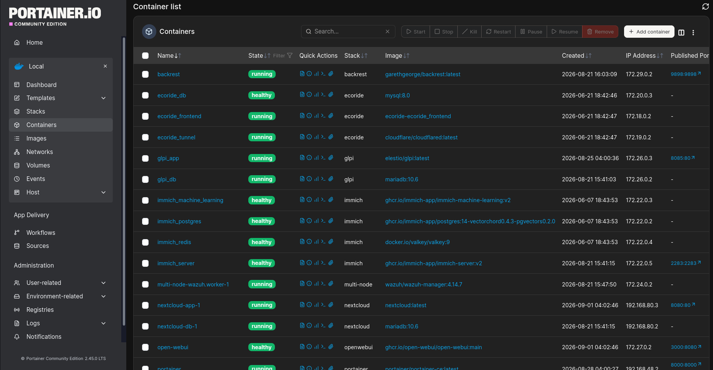
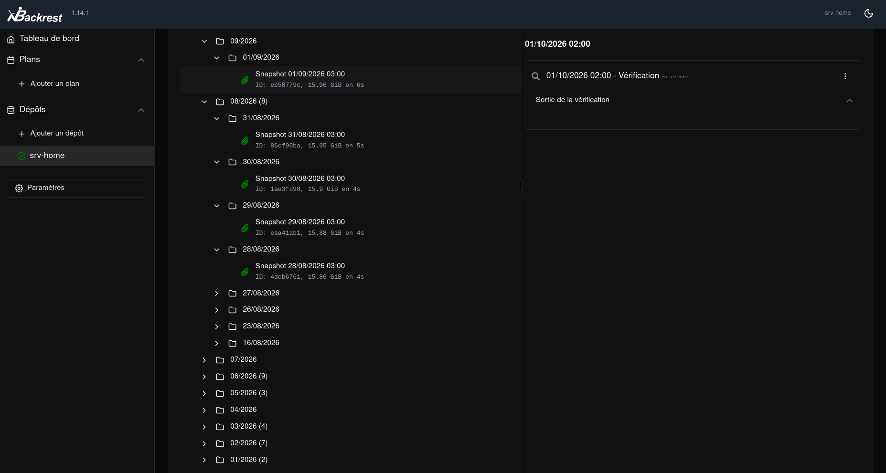

# 🛡️ Homelab Self-hosting & dé-googleïsation

**Contexte** : Dans une logique de reprendre la main sur mes données et de réduire l'omniprésence de Google dans mon quotidien, j'ai construit ma propre infrastructure auto-hébergée, à domicile, sur du matériel que je contrôle. Photos, fichiers, mots de passe, assistant IA, sauvegardes : tout tourne chez moi et n'est accessible qu'à travers un VPN chiffré, sans exposer le moindre port sur Internet. J'ai poussé le principe jusqu'au mobile en flashent un Pixel 9 avec GrapheneOS.

**Ce qui a été réalisé** :
- Serveur **Debian 13 (trixie)** auto-hébergé, **zéro port ouvert sur Internet** — tout passe par le tailnet
- **Une quinzaine de conteneurs Docker** en stacks compose organisées dans `/apps/` (Immich, Nextcloud, Vaultwarden, OpenWebUI, SearXNG, Backrest, Portainer, Watchtower)
- Services anti-Google : **Immich** (photos), **Nextcloud** (Drive), **Vaultwarden** (mots de passe), **SearXNG** (recherche web), **OpenWebUI + API DeepSeek** (assistant IA)
- **Accès distant chiffré** (WireGuard) via Tailscale + MagicDNS, depuis Pixel/PC/n'importe où
- **Dé-googleïsation mobile** : Pixel 9 → **GrapheneOS**

**Matériel** : Dell OptiPlex 3060 (i5-8500, 6 cœurs, 23 Go RAM). 3 disques séparés : système 226 Go, SSD données `/mnt/data` (220 Go), SSD backup `/mnt/backup` (457 Go).

## 📦 Des services pour remplacer Google

| Conteneur | Rôle | Accès |
|---|---|---|
| **Immich** | Photos & vidéos (anti Google Photos) | Tailscale |
| **Nextcloud** | Fichiers / Drive (anti Google Drive) | Tailscale |
| **Vaultwarden** | Gestionnaire de mots de passe (interface Bitwarden) | HTTPS |
| **OpenWebUI + DeepSeek** | Assistant IA avec recherche web (SearXNG) | HTTPS |
| **SearXNG** | Moteur de recherche auto-hébergé | interne |
| **Backrest / restic** | Sauvegardes chiffrées et dédupliquées | Tailscale |
| **Portainer** | Gestion des conteneurs (Stacks) | Tailscale |
| **Watchtower** | Mise à jour automatique des images (04h00) | interne |

*Vue de Portainer (stacks Docker)*

## 🗂 Stockage et sauvegardes

- Système : `/dev/sda` (226 Go)
- Données applicatives (Immich, Nextcloud) : `/dev/sdb` → `/mnt/data` (220 Go)
- Sauvegardes : `/dev/sdc` → `/mnt/backup` (457 Go)

Sauvegardes par **restic** (chiffrées, dédupliquées, versionnées) orchestrées par **Backrest** vers le SSD `/mnt/backup`. Elles couvrent les données Immich, Nextcloud et les configurations des conteneurs.

*Note d'honnêteté : sauvegarde locale uniquement pour l'instant — pas encore de copie hors-site type B2/S3. Point d'amélioration identifié.*

*Vue de Backrest (planifications de sauvegarde)*

## 🌐 Réseau : accès distant sans exposition

L'infrastructure n'est accessible que via un **VPN mesh Tailscale (WireGuard)**. Aucun port redirigé sur la box, aucune IP fixe, aucune exposition publique.

- **MagicDNS** (`CorpDNS`) : résolution interne par nom
- **Reverse proxy HTTPS** : un reverse proxy termine le HTTPS avec un certificat Tailscale valide, ce qui permet à **Vaultwarden** et **OpenWebUI** d'être servis en HTTPS tout en restant en boucle locale (non exposés au tailnet)
- C'est ce qui rend leur usage possible depuis le téléphone : Bitwarden et les navigateurs rejettent le HTTP non chiffré, d'où le TLS via le proxy

➜  ~ tailscale status                                                   
XX.XX.XX.XX    srv-home       F@  linux    active;                                                              
XX.XX.XX.XX    chuwi-lab      F@  linux    offline, last seen 2d ago                                     
XX.XX.XX.XX    fedoratitude   F@  linux    active;  
XX.XX.XX.XX    win-serv-2022  F@  windows  offline, last seen 56m ago   

*Vue du tailnet (tailscale status)*

## 📱 Dé-googleïsation du mobile : GrapheneOS sur Pixel 9

Le Pixel 9 a été flashé avec **GrapheneOS**, un Android libre et durci, sans les services Google préinstallés.

- **Pas de Google Play Services** : moins de télémétrie et de collecte
- **Sandboxing renforcé** : les services Google éventuels tournent comme de simples applications, sans privilèges système, cloisonnés
- **Durcissement système** : démarrage vérifié (verified boot), permissions très granulaires, protections mémoire renforcées
- **Autonomie** : pas de compte Google, fonctionnement indépendant

*Écran GrapheneOS sur le Pixel 9*

## 🛡 Sécurité

| Mesure | État |
|---|---|
| VPN WireGuard mesh, zéro port-forward | ✅ |
| MagicDNS | ✅ |
| SSH durci : port non standard, `PasswordAuthentication no` | ✅ |
| Reverse proxy HTTPS (certificat MagicDNS) | ✅ |
| Services sensibles en loopback (Vaultwarden, OpenWebUI) | ✅ |
